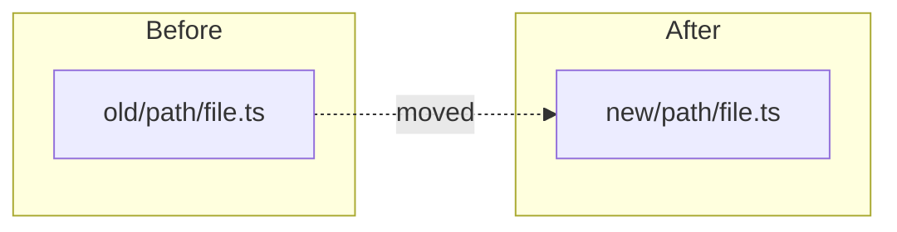
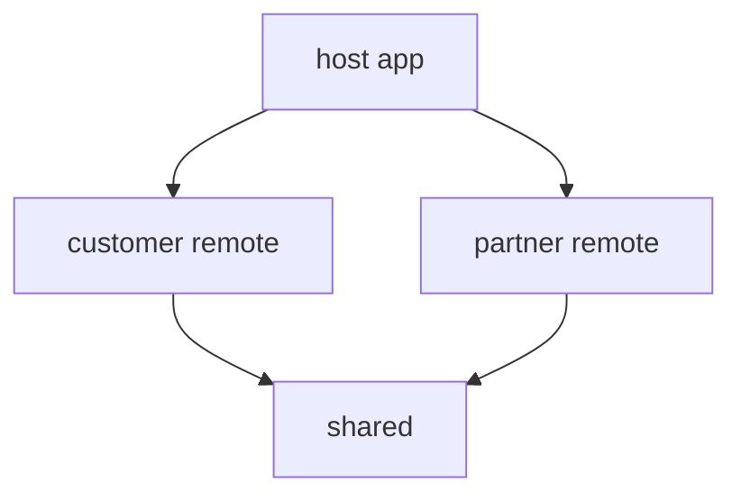
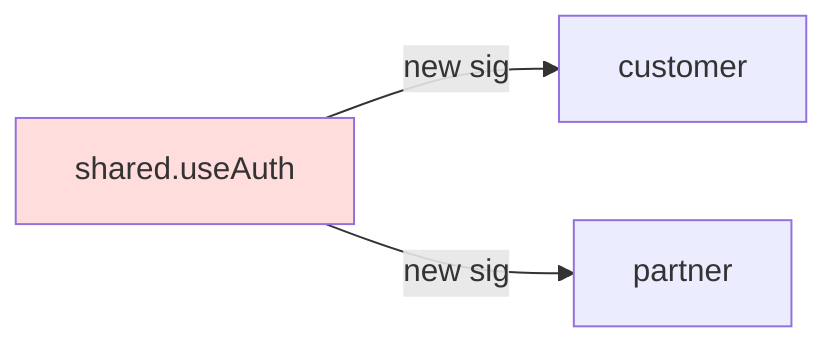
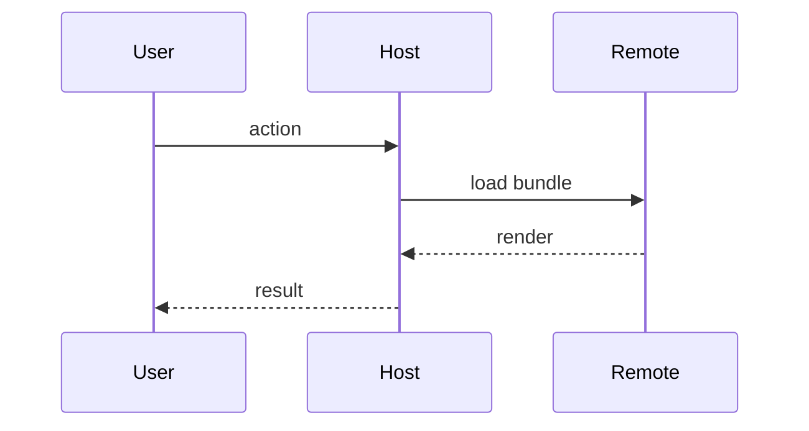

# Create PR Skill

레포 컨벤션에 맞는 PR을 생성한다. 본문은 `.github/pull_request_template.md` 가 정본이며, 이 스킬은 **간결성과 구조 PR 다이어그램 강제** 를 책임진다.

## Context (먼저 읽을 것)

**PR은 스키밍용 짧은 문서입니다.** 리뷰어가 1분 안에 스캔할 수 있어야 한다.

- 장문 (설계/배경/조사/마이그레이션 가이드) 은 **`docs/` 에 문서로 분리** 하고 `[Docs]` PR 로 별도 제출.
  - cross-package / repo-wide → `docs/`
  - 아키텍처 결정 → `docs/adr/`
  - 패키지 스코프 → `packages/<pkg>/docs/`
- PR 본문에서는 그 문서 링크만 남긴다.
- 이 원칙이 하네스 1 (간결성) 의 근거.

## Goal

- 적절한 베이스 브랜치를 자동 검출 (일반 작업은 `release/X.X.X`)
- GitHub 자동 주입 템플릿의 섹션을 채워 PR 생성
- 본문이 길거나 구조 PR인데 Mermaid 다이어그램이 없으면 **PR 생성을 중단**

## Pre-PR Checklist

1. 작업 트리/diff 확인 (`git status --short --branch`, `git diff --stat`).
2. 의도된 파일만 staged 인지 확인.
3. secrets/`.env` 파일이 staged 되지 않았는지 확인.
4. **베이스 브랜치 자동 검출**:
   - 사용자가 명시했다면 그 값을 그대로 사용.
   - 아니면 현재 브랜치가 분기한 지점을 검출:
     ```bash
     git branch -r | grep release
     git log --oneline release/X.X.X..HEAD | wc -l
     git log --oneline main..HEAD | wc -l
     ```
   - 커밋이 적게 나오는 브랜치가 실제 base. 보통 `release/X.X.X`.
   - **`main` 타겟은 명시적 요청 시에만**. 릴리즈 머지는 `release-create`, 번들 hotfix backport는 `bundle-backport` 스킬이 별도로 담당.

## Title Convention

- `[Feature/{TICKET}] {한글 제목}`
- `[Bugfix/{TICKET}] {한글 제목}`
- `[Refactor/{TICKET}] {한글 제목}` (ticket 없으면 `[Refactor] {제목}`)
- `[Chore] {제목}`
- `[Docs] {제목}`

**한글 제목은 명령형 톤**. "GPS 추적 추가" ✅ / "GPS 관련" ❌

## 톤 — 친근하게 (필수)

PR **본문·리뷰 코멘트**는 **친근한 `해요체`** 로 쓴다. 동료에게 설명하듯 따뜻하게 — 딱딱한 문어체("~한다/~된다")나 사전식 한자어로 쓰지 않는다. (제목은 위 명령형 유지, 본문만 해요체.)

- 친근하다고 장황해지지 말 것 — 하네스 1(간결성)·스캔 가독성은 그대로 유지.
- **이모티콘은 쓰지 않는다(불필요).**
- 미소 팀 PR 작성 원칙.

## Body

GitHub 가 PR 생성 시 `.github/pull_request_template.md` 를 **자동 주입**한다. 이 스킬은 본문 섹션을 새로 정의하지 않는다 — **주입된 템플릿의 섹션을 그대로 채운다**.

섹션 (정본은 템플릿 파일):

1. **작업 내용** (mandatory)
2. **테스트** (mandatory)
3. **배포 영향** (mandatory; `[Docs]`/`[Chore]` 는 'N/A' 허용)
4. **UI/UX 변경** (해당 시)
5. **리뷰 포인트** (선택)

---

## 하네스 (필수, 위반 시 PR 생성 중단)

### 하네스 1 — 간결성 + 세미자동 docs 분리

각 섹션을 작성한 뒤 self-check:

- 한 섹션이 **3문장 또는 5 bullet 을 초과** 하면 **세미자동 분리 흐름** 시작 (단순 중단 아님).

**목적**: PR 은 스키밍용 짧은 문서. 장문은 영구 문서로. 분리 마찰을 도구가 줄여줌. 사용자 확인 게이트가 안전장치.

#### Step 1 — 분리 제안 작성

길어진 섹션마다 다음을 도출:

1. **제안 파일 경로** (heuristic):
   - 단일 패키지에 한정된 내용 → `packages/<pkg>/docs/<slug>.md`
   - 아키텍처 결정 키워드 ("결정"/"선택"/"trade-off"/"왜") 포함 → `docs/adr/<slug>.md`
   - cross-package / repo-wide → `docs/<slug>.md`
2. **제안 파일명**: 섹션 주제에서 kebab-case slug (영문 또는 한글 모두 가능, 영문 권장)
3. **제안 docs PR 제목**: `[Docs/{TICKET}] {파일명을 한글로 풀어쓴 제목}`

#### Step 2 — 사용자 확인 (`AskUserQuestion`)

4개 옵션:

- **분리 진행** — 제안된 경로/이름으로 자동 실행
- **경로 변경** — `docs/` / `docs/adr/` / `packages/<pkg>/docs/` 중 선택
- **수동 정리** — 중단 + 안내만, 사용자가 직접 처리
- **취소** — PR 생성 자체 중단

#### Step 3 — 자동 실행 ("분리 진행" 선택 시)

전제: 작업 브랜치가 이미 commit 된 상태 (Pre-PR Checklist 가 보장).

```bash
ORIGINAL_BRANCH=$(git branch --show-current)
BASE_BRANCH=<auto-detected base>  # 보통 release/X.X.X
SLUG=<제안 또는 사용자 지정>
DOCS_PATH=<제안 또는 사용자 지정 경로>

# 1. base 에서 docs 브랜치 분기
git checkout -b "docs/{TICKET}/${SLUG}" "${BASE_BRANCH}"

# 2. docs 파일 작성 — 추출된 섹션 내용 + 컨텍스트 헤더
#    헤더 예시:
#    # {한글 제목}
#    > 관련 PR: feature/{TICKET}/{work-title} (PRD-{TICKET})
mkdir -p "$(dirname "${DOCS_PATH}")"
cat > "${DOCS_PATH}" <<EOF
# {한글 제목}

> 관련 PR: PRD-{TICKET}

{추출된 장문 본문}
EOF

# 3. commit + push
git add "${DOCS_PATH}"
git commit -m "[Docs/{TICKET}] ${파일명 한글} 추가

Co-Authored-By: Claude <noreply@anthropic.com>"
git push -u origin "docs/{TICKET}/${SLUG}"

# 4. docs PR 생성
gh pr create --base "${BASE_BRANCH}" --head "docs/{TICKET}/${SLUG}" \
  --title "[Docs/{TICKET}] ${파일명 한글} 추가" \
  --body-file /tmp/docs_pr_body.md
# docs PR 본문은 동일 5섹션 따라 작성 — "작업 내용" 에는 어느 원본 작업의 분리 문서인지 명시

# 5. 원본 작업 브랜치로 복귀
git checkout "${ORIGINAL_BRANCH}"
```

#### Step 4 — 원본 PR 본문 갱신

분리된 섹션은 **2-3 문장 요약 + docs PR 링크** 로 교체:

```markdown
## 작업 내용

{1-2 문장 요약 — "무엇 + 왜"}.
상세 설계/배경은 #{docs-pr-number} 참조.
```

링크는 docs PR 의 번호 (방금 생성한 PR 번호) 를 사용.

#### Step 5 — 원본 PR 생성 진행

원본 PR 의 body 가 모든 섹션이 한도 안에 들어왔는지 다시 self-check 후, 통과하면 `gh pr create` 로 원본 PR 생성.

#### "수동 정리" / "취소" 처리

- **수동 정리**: 기존 동작 — *"이 섹션은 너무 깁니다. docs/ 분리 후 다시 시도하세요"* 안내 후 중단. 자동 실행 없음.
- **취소**: PR 생성 자체 중단. 작업 브랜치 그대로 유지.

### 하네스 2 — 구조 PR 검출

다음 시그널 중 **하나라도** 매칭되면 구조 PR로 판정:

- PR 제목이 `[Refactor/...]` 또는 `[Refactor]`
- `git diff --diff-filter=R HEAD` 결과가 비어있지 않음 (파일 rename/move)
- `git diff --name-only` 에 다음 중 하나 포함:
  - `module-federation.config.*`
  - `rspack.config.*`
  - `metro.config.*`
  - `webpack.config.*`
- `git diff --name-only` 에 `packages/shared/**/index.ts` 또는 `packages/shared/**/index.tsx` 포함 (공개 surface 변경)

구조 PR로 판정되면 **본문에 Mermaid 다이어그램이 반드시 존재해야 한다**. 없으면 PR 생성 중단 후 사용자에게 다이어그램 추가 안내.

### 하네스 3 — Mermaid 패턴 선택

구조 PR의 변경 유형에 따라 다음 패턴 중 가장 가까운 것을 선택:

**(a) 디렉토리 rename/move** → `graph LR` (Before/After 트리)



**(b) MF host/remote 의존성 변경** → `graph TD`



**(c) Shared API 시그니처 변경** → `graph LR` (의존성 + 변경 엣지 강조)



**(d) 호출 흐름 변경** → `sequenceDiagram`



다이어그램은 **작업 내용** 섹션 직후 또는 **리뷰 포인트** 섹션 안에 삽입.

---

## 권장 생성 흐름

1. `git status --short --branch`, `git diff --stat` 으로 변경 확인.
2. 베이스 브랜치 자동 검출 (Pre-PR Checklist 참조).
3. 구조 PR 여부 판정 (하네스 2).
4. PR 본문 초안 작성 (템플릿 섹션 채우기, 구조 PR 이면 Mermaid 포함).
5. **하네스 1 self-check** — 섹션 길이 검사.
6. **하네스 2 self-check** — 구조 PR이면 Mermaid 존재 확인.
7. 하나라도 위반이면 **중단 + 사용자 보고**. 모두 통과하면 push + PR 생성:
   ```bash
   git push -u origin <branch>
   cat > /tmp/pr_body.md << 'ENDOFFILE'
   ...
   ENDOFFILE
   gh pr create --base <auto-detected-base> --head <branch> --title "<TITLE>" --body-file /tmp/pr_body.md
   gh pr view --json title,body,baseRefName,headRefName,url
   ```

## 베이스 브랜치를 잘못 설정한 PR 수정

PR 닫고 재생성 금지. REST API 로 base 변경:

```bash
gh api repos/{owner}/{repo}/pulls/{number} --method PATCH \
  --field base="release/x.x.x" \
  --jq '.base.ref + " <- " + .head.ref'
```

이미 닫혔다면 먼저 `gh pr reopen {number}`.

## PR 본문 수정

`gh pr edit` 는 classic Projects 의 GraphQL deprecation 에러를 낼 수 있다. REST API 사용:

```bash
gh api repos/{owner}/{repo}/pulls/{number} --method PATCH \
  --field title="<TITLE>" \
  --field body=@/tmp/pr_body.md \
  --jq '.html_url'
```

본문은 `/tmp/pr_body.md` 로 전달 — 백틱 escaping 회피.

## 스코프 노트

- 일반 작업 PR. base = `release/X.X.X` 가 기본.
- Release merge (`Release/{version}` 형식) → `release-create` 스킬.
- Bundle hotfix backport → `bundle-backport` 스킬.
- `main` 타겟은 위 두 스킬 외에는 명시적 요청 시에만.

## 안전 가드

- 의도하지 않은 파일 포함 금지.
- 필수 섹션 누락 금지.
- 영어 단독 본문 금지 (한글 기준).
- 명시적 요청 없이 `main` 타겟 금지.
- 하네스 1/2 위반 시 PR 생성 금지 — 사용자에게 보고하고 멈춤.
